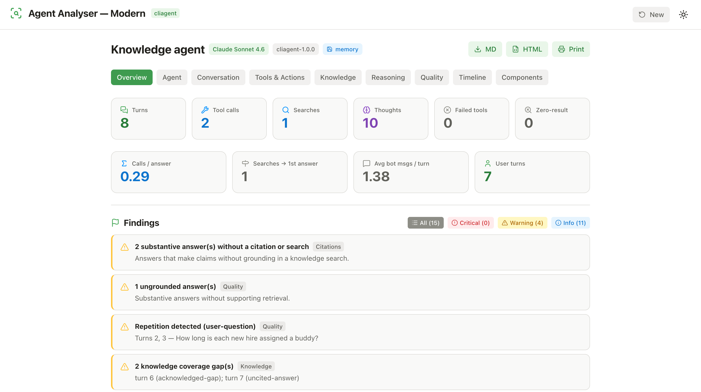
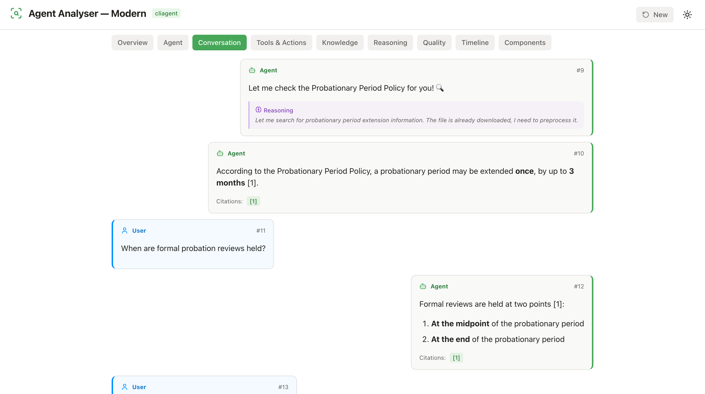
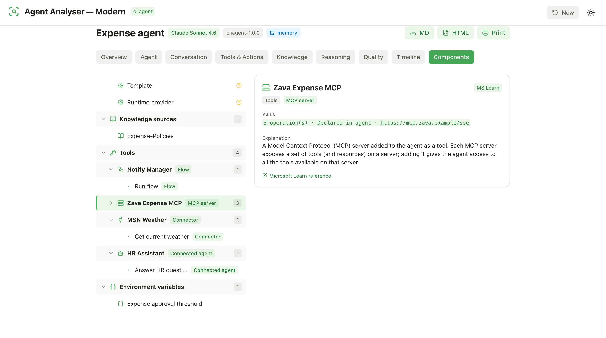
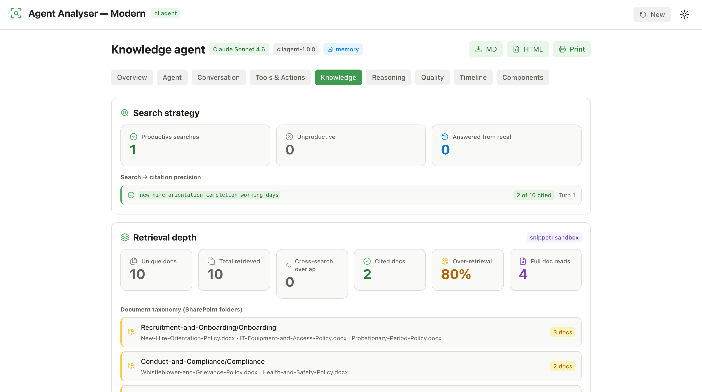
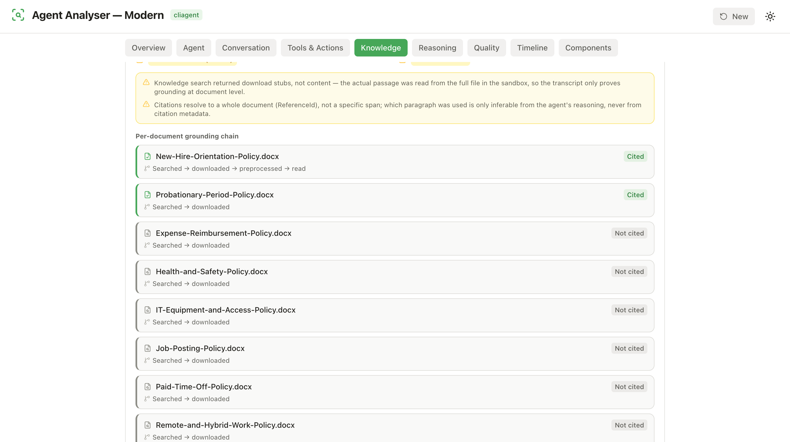
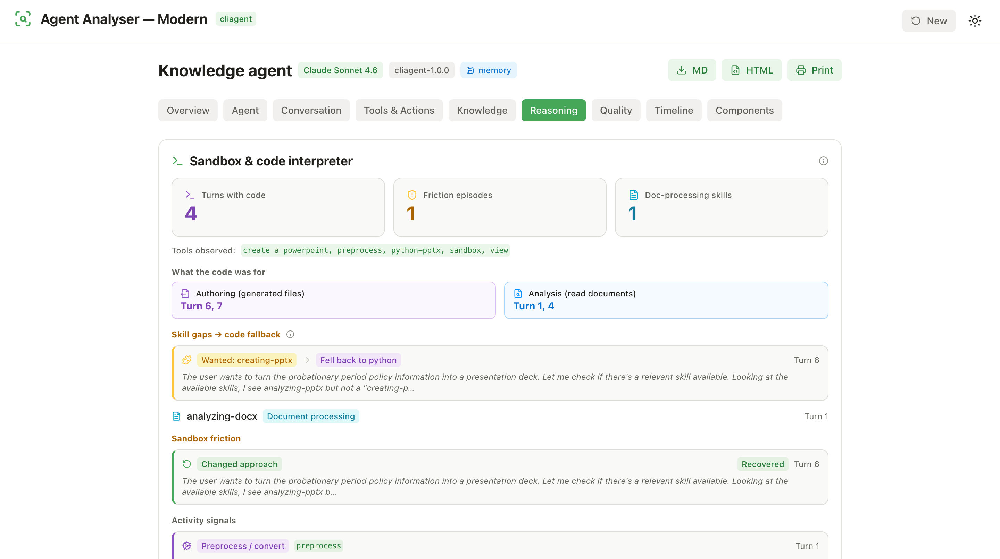
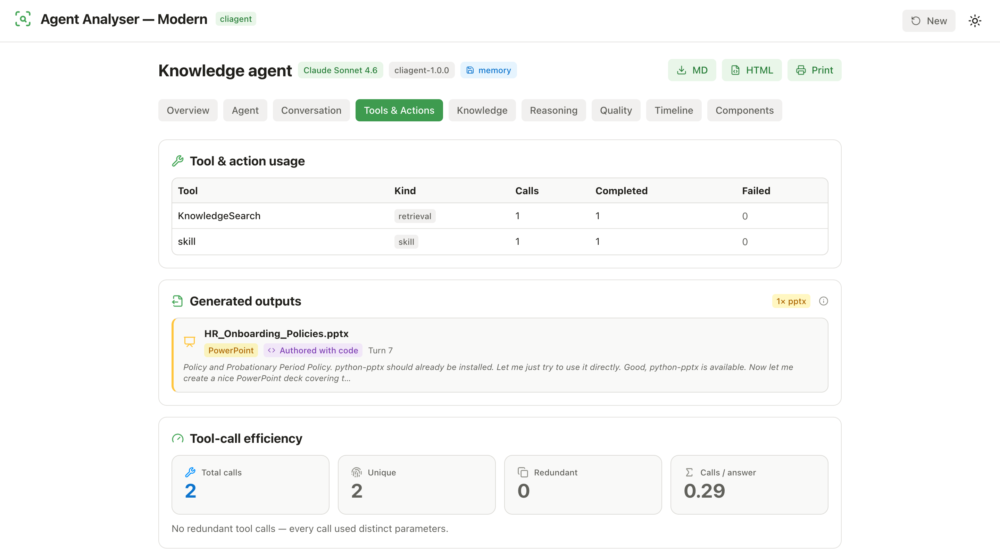
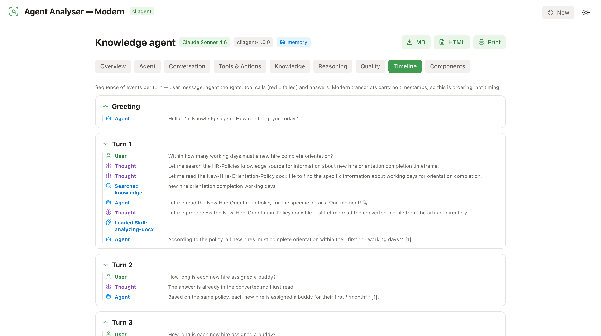
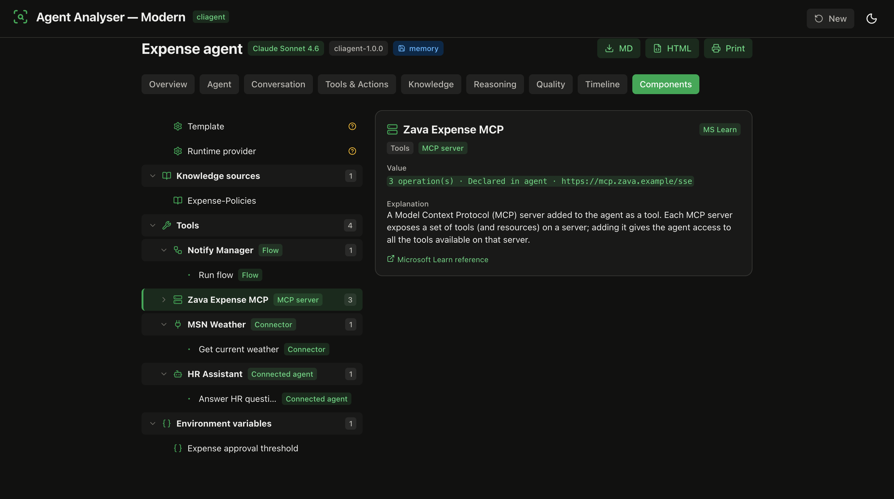
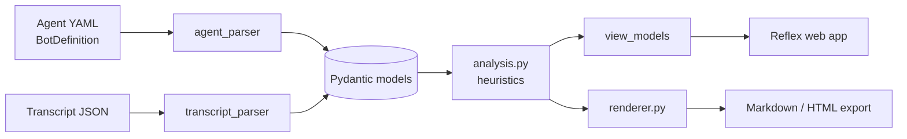

<div align="center">

# 🔎 Agent Analyser — Modern

**Peek under the hood of *modern* Microsoft Copilot Studio agents.**
Upload an agent build YAML and/or a conversation transcript and get a local,
heuristic report — agent profile, conversation flow, tool & knowledge usage,
reasoning trace, groundedness, instruction compliance, Copilot Credit estimate
and severity-tagged quick-win findings.

[](#license)
[](https://www.python.org/)
[](https://reflex.dev/)
[](https://docs.astral.sh/uv/)
[](https://github.com/astral-sh/ruff)
[](#testing)
[](#no-llm-fully-local)

[](https://github.com/Roelzz/-mcs-modern-agent-analyser/commits)
[](https://github.com/Roelzz/-mcs-modern-agent-analyser/issues)
[](https://github.com/Roelzz/-mcs-modern-agent-analyser/stargazers)




</div>

---

## What is this?

**Agent Analyser — Modern** is a local web app (and CLI) that reverse-engineers what a
*modern* Copilot Studio agent actually did in a conversation. Modern agents use the
`cliagent` template with a single instruction-driven LLM, knowledge sources and a
sandbox/code-interpreter — **no topics, no orchestrator** — and they emit a different
transcript shape (`role` / `text` / `toolCalls` / `thoughts`, no timestamps).

You feed it two artifacts:

| Input | What it is |
| --- | --- |
| **Agent build YAML** | the modern `BotDefinition` export — model, instructions, knowledge sources, tools (MCP / connectors / connected agents / flows), env vars |
| **Transcript JSON** | a modern conversation export — flat array of `{ role, id, text, toolCalls[], thoughts[] }` |

Either one alone produces a partial report; **both together** unlock the
cross-referenced analysis (instruction compliance, defined-but-unused knowledge
sources, tools used but never declared).

> Sibling of the classic `Agent_analyser`. Because modern agents have a different
> shape *and* a different transcript format, this is a purpose-built tool rather than
> a fork.

### <a name="no-llm-fully-local"></a>🔒 No LLM, fully local

Every insight is produced by **deterministic heuristics** — no external LLM, no API
keys, no data leaving your machine. Drop a file, read the report.

---

## ✨ Highlights

- **9 analysis tabs** — Overview, Agent, Conversation, Tools & Actions, Knowledge, Reasoning, Quality, Timeline, Components.
- **Chat-style transcript** with rendered Markdown, inline reasoning, citations and a sequence diagram.
- **Component hierarchy** — agent → knowledge → tools *grouped by kind* (MCP server / connector / connected agent / flow) → each tool's operations, with plain-English explanations and Microsoft Learn links.
- **Knowledge & grounding pipeline** — search precision, retrieval depth, SharePoint taxonomy and a per-document `searched → downloaded → preprocessed → read` chain that makes document-level vs passage-level grounding explicit.
- **Sandbox & code interpreter** — separates *authoring* (generating files) from *analysis* (reading documents), and flags skill-gap → raw-code fallbacks.
- **Generated outputs** — surfaces files the agent built (e.g. a `.pptx`) and how it made them.
- **Copilot Credit estimate** — heuristic per-conversation cost, linked to the [official message-billing model](https://learn.microsoft.com/microsoft-copilot-studio/requirements-messages-management).
- **Findings engine** — severity-tagged (Critical / Warning / Info) quick wins.
- **Exports** — Markdown, standalone HTML, or Print.
- **Light & dark** themes.

---

## 🚀 Quick start

```bash
uv sync
cp .env.example .env

# Web app (dev: frontend :3000, backend :8000)
uv run reflex run
```

Open <http://localhost:3000>, then either **drag in** a transcript JSON / agent YAML
or click one of the bundled samples (Knowledge agent · Autonomous agent · Code
interpreter · Generated deck).

Prefer the terminal?

```bash
# CLI: files -> Markdown report
uv run python main.py samples/sample_transcript.json --agent samples/sample_agent.yaml -o report.md
```

---

## 🖼️ A tour of the tabs

### Conversation — chat UX + sequence diagram

Real chat orientation (user left, agent right), rendered Markdown, inline reasoning,
clickable `[n]` citations, and a mermaid sequence diagram across the User / Agent /
Knowledge / Tools lanes.



### Components — the agent, hierarchically

The question that started this feature: *"an MCP server is added to the agent but it
just shows some tools — shouldn't there be a hierarchy?"* Now there is. Tools are
grouped by **kind** (Flow, MCP server, Connector, Connected agent) and each node
explains itself with a Microsoft Learn reference.



### Knowledge — search, retrieval depth & grounding pipeline

See which searches were productive, how many retrieved docs were actually cited
(over-retrieval), the SharePoint folder taxonomy, and a per-document grounding chain
that spells out the document-level vs passage-level caveat.




### Reasoning — chain-of-thought, sandbox & code interpreter

The reasoning timeline plus a breakdown of what the code interpreter was *for*:
**authoring** (generating files) vs **analysis** (reading documents), and any
**skill-gap → code fallback** (e.g. *wanted `creating-pptx`, fell back to `python`*).



### Tools & Actions — usage, hidden failures & generated outputs

Per-tool call/complete/fail counts (including failures hidden behind a `completed`
status), tool-call efficiency, and the files the agent generated.



### Timeline — ordered events per turn

User message → thoughts → searches → skills → answers, colour-coded. Modern
transcripts carry no timestamps, so this is *ordering*, not timing.



### Dark mode



---

## 🧩 What each tab analyses

| Tab | Surfaces |
| --- | --- |
| **Overview** | Headline + derived metrics (turns, tool calls, searches, thoughts, failed/zero-result, calls-per-answer, searches→first-answer) and the severity-filtered Findings list. |
| **Agent** | Model, template, recognizer, instructions, memory, auth mode/trigger, access control, knowledge sources, environment variables. |
| **Conversation** | Sequence diagram + chat-style transcript with Markdown, reasoning, citations, transcript search and a raw-JSON toggle. |
| **Tools & Actions** | Per-tool usage, hidden-failure detection, generated outputs, tool-call efficiency (redundant calls). |
| **Knowledge** | Search strategy & citation precision, retrieval depth & over-retrieval, SharePoint taxonomy, per-document grounding pipeline. |
| **Reasoning** | Chain-of-thought timeline, sandbox/code-interpreter purpose split, skill-gap → code fallbacks, friction & recovery. |
| **Quality** | Groundedness, ungrounded answers, dangling & unverifiable citations, repetition, premise corrections, honest knowledge gaps. |
| **Timeline** | Ordered per-turn event stream (no timestamps in modern transcripts). |
| **Components** | Full component hierarchy with per-kind tool grouping, plain-English explanations and Microsoft Learn references. |

Cross-cutting: a **Copilot Credit** estimate, a **Findings** engine, and **cross-reference**
checks when both YAML and transcript are supplied (instruction compliance,
unused knowledge sources, undeclared tools).

---

## 🏗️ How it works



---

## 📥 Inputs

- **Agent build YAML** — the modern `BotDefinition` export (model, instructions,
  knowledge sources, tools, env vars).
- **Transcript JSON** — modern flat array of `{ role, id, text, toolCalls[], thoughts[] }`.

Either alone produces a partial report; both together enable the full cross-reference.

---

## 📂 Project structure

```
main.py               CLI entry (Typer): files -> Markdown report
models.py             Pydantic models (agent profile, conversation, analysis results)
agent_parser.py       Modern BotDefinition YAML -> AgentProfile
transcript_parser.py  Modern transcript JSON -> Conversation (turn grouping, tool-result parsing)
analysis.py           Heuristic analysis features (the heart of the tool)
renderer.py           Markdown + HTML + mermaid rendering
explainer.py          Component explanations (Microsoft Learn references)
config.py             Logging / settings bootstrap
rxconfig.py           Reflex config (dev 3000/8000, prod single-port 2009)
web/                  Reflex app (pages, state, view-models, components, mermaid)
data/                 Component explainer reference data
samples/              Example agent YAMLs + transcripts
docs/screenshots/     README images
tests/                Pytest suite (120 tests)
```

---

## 🛠️ Tech stack

Python 3.12 · [uv](https://docs.astral.sh/uv/) · [Reflex](https://reflex.dev/) ≥ 0.9.5 ·
Pydantic · PyYAML · loguru · Typer (CLI) · Ruff · Pytest.

> **Ports:** Reflex still runs a frontend **and** a backend. In dev that's `:3000`
> (frontend) + `:8000` (backend); in prod (`REFLEX_ENV=prod`) both are served on a
> single port (`PORT`, default **2009**).

---

## <a name="testing"></a>✅ Testing

```bash
uv run pytest          # 120 tests
uv run ruff check .    # lint
```

---

## 🚢 Deploy

Coolify + Nixpacks (matches the classic analyser). Set `REFLEX_ENV=prod` so the app
serves on a single port; start command:

```bash
uv run reflex run --env prod
```

---

## <a name="license"></a>📄 License

MIT.
