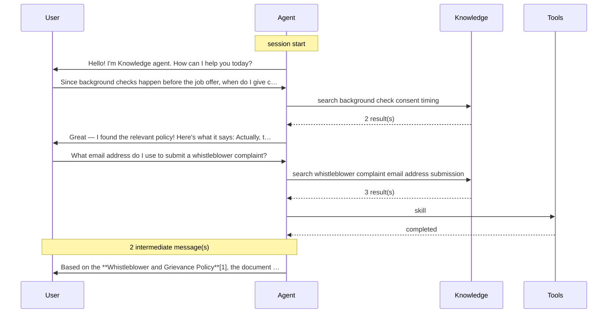

# Agent analysis — Knowledge agent

## Findings

| | Category | Finding | Detail |
| --- | --- | --- | --- |
| 🔵 | Tools | Agent retried or changed approach 2 time(s) | Let me read the ephemeral file properly. |
| 🔵 | Knowledge | 2 retrieved document(s) never used in an answer | _copy-test.txt, Anti-Harassment-Policy.docx |
| 🔵 | Quality | Honest knowledge gap (good) | Agent acknowledged missing info for: What email address do I use to submit a whistleblower complaint? |
| 🔵 | Reasoning | Premise correction (good) | Great — I found the relevant policy! Here's what it says: Actually, the premise of your question needs a small correction. According to the **Background Check Policy**[1]: > *"Background checks are c… |

## Agent profile

| Property | Value |
| --- | --- |
| Display name | Knowledge agent |
| Model | Claude Sonnet 4.6 |
| Template | cliagent-1.0.0 |
| Recognizer | CLICopilotRecognizer |
| Memory enabled | Yes |
| Authentication | Integrated |
| Knowledge sources | 1 |
| Environment variables | 5 |
| Tool components | 0 |
| Last modified | 2026-06-14T11:05:15+00:00 |

**Instructions**

> Sometimes responses from the agent can take a long time, can you output intermediate chain of thought messages to the users of this agent to explain what you're doing? To ease users and support the User Experience?

**Knowledge sources**

| Name | Kind | Location | State |
| --- | --- | --- | --- |
| HR-Policies | SharePointKnowledgeSource | https://copilotstudiotraining.sharepoint.com/sites/RRS/Shared Documents/HR-Policies | Active |

**Environment variables**

| Name | Type | Default |
| --- | --- | --- |
| Should the Peek Button Be Showed | String | False |
| LOB Guid List for user expansion | String | 00000000-00000000-00000000-00000000 |
| LOB Guid List | String | 00000000-00000000-00000000-00000000 |
| SLA Web Client Deprecation Acknowledge | Number | 0 |
| Should only leaf node selection be allowed | Boolean | False |

## Conversation overview

| Metric | Value |
| --- | --- |
| Turns | 3 |
| User messages | 2 |
| Bot messages | 5 |
| Tool calls | 3 |
| Knowledge searches | 2 |
| Reasoning blocks | 6 |
| Failed tool calls | 0 |
| Zero-result searches | 0 |

## Conversation flow

## Tools

| Tool | Calls | Completed | Failed |
| --- | --- | --- | --- |
| KnowledgeSearch | 2 | 2 | 0 |
| skill | 1 | 1 | 0 |

**Skills loaded:** Loaded Skill: analyzing-docx

**Retry / approach changes:**
- Let me read the ephemeral file properly.
- Let me preprocess the Whistleblower-and-Grievance-Policy.docx file to get the full content.Let me try a different approach to read the DOCX file content.The po…

## Knowledge

**Searches**

| Query | Results | Zero-result |
| --- | --- | --- |
| background check consent timing | 2 | no |
| whistleblower complaint email address submission | 3 | no |

**Documents retrieved**

| Title | Reference | Used in answer |
| --- | --- | --- |
| Background-Check-Policy.docx | turn1doc1 | yes |
| _copy-test.txt | turn1doc2 | no |
| Whistleblower-and-Grievance-Policy.docx | turn2doc1 | yes |
| Anti-Harassment-Policy.docx | turn2doc2 | no |

**Source locations:** https://copilotstudiotraining.sharepoint.com/sites/RRS

## Reasoning

- **Reasoning blocks:** 6
- **Per turn:** 0, 3, 3

**Retry / confusion signals:**
- Let me read the ephemeral file properly.
- Let me preprocess the Whistleblower-and-Grievance-Policy.docx file to get the full content.Let me try a different approach to read the DOCX file content.The po…

**Premise corrections (agent corrected the user):**
- Great — I found the relevant policy! Here's what it says: Actually, the premise of your question needs a small correction. According to the **Background Check Policy**[1]: > *"Background checks are c…

## Quality & groundedness

- **Grounded answers:** 2
- **Ungrounded answers:** 0

**Honest knowledge gaps (good):**
- ✅ What email address do I use to submit a whistleblower complaint?

**Notes:**
- 2 retrieved document(s) were referenced in answers

## Instruction compliance

| | Instruction | Check | Evidence |
| --- | --- | --- | --- |
| ✅ | Emit intermediate / chain-of-thought messages | reasoning blocks or multi-message streaming present | 6 reasoning block(s); 1 turn(s) streamed multiple messages |

## Cross-reference

- **Model in use:** Claude Sonnet 4.6
- **Defined knowledge sources:** HR-Policies
- **Contributed in conversation:** HR-Policies
